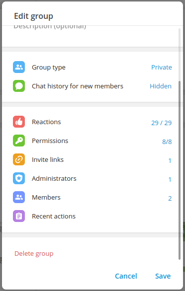

# Telegram Bot Terminator

Telegram CAPTCHA bot. Fight SPAM in Telegram groups.

Cloud hosted instance
[@bot_terminator_bot](https://t.me/bot_terminator_bot)

## How does it work

1. Add the bot to your group or supergroup
2. Ask the group owner to grant the bot `admin` permission
3. Everytime a new user join the group, the user has to pass the CAPTCHA to obtain normal user rights
4. New user sending out suspicious will be banned as well 

## Step-by-step installation guide

Open [@bot_terminator_bot](https://t.me/bot_terminator_bot) on PC or phone with Telegram installed

Select "START"
 

Open the "Bot Info" dialog

Choose "Add to Group" and "OK"

Go to the group and open the "Edit group" dialog

Select "Administrators"

Find and select "Bot Terminator"

Default settings would be fine. Click "Save"

Select "Close"

Select "Save"

## Self-hosting instance

1. Talk to [BotFather](https://t.me/BotFather)
2. `git clone` this project
3. Rename `.env.sample` to `.env` and modify configurations
4. `docker-compose up -d`

## Thanks

[python-telegram-bot](https://github.com/python-telegram-bot/python-telegram-bot)

